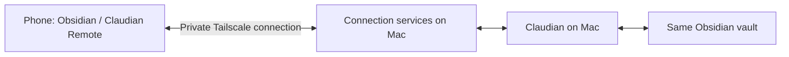

# Claudian Remote

**English** | [中文](README.zh-CN.md)

**Continue your Mac's Claudian conversations in Obsidian on your phone.**

Away from your computer, you can send tasks, follow streaming replies and execution logs, and add photos or files to the current conversation. Model requests, vault access, and tool execution still run through Claudian on your Mac, using its existing permission settings.

[Getting started (Chinese)](docs/getting-started.md) · [FAQ and troubleshooting (Chinese)](docs/troubleshooting.md) · [Release notes (Chinese)](docs/release-notes-0.2.0.md)

> Current version: **0.2.0**. Available in the [Obsidian community plugin directory](https://community.obsidian.md/plugins/claudian-remote): click **Add to Obsidian** to install. Download the background services from [GitHub Releases](https://github.com/cuimino-kaziy/claudian-remote/releases/tag/0.2.0).

## What you can do

| What you want to do | How to do it on your phone |
|---|---|
| Continue a task from your computer | Open the remote view in the same vault and continue typing in the current conversation |
| Follow task progress | Read streaming replies, Markdown, and execution logs, and respond to permission requests for the current task |
| Send materials from your phone | Tap `+` beside the input field, choose photos or files, and wait for attachments to be ready before sending |
| Find an earlier conversation | Open the history panel to search by title, switch conversations, or archive conversations you no longer need |
| Manage the connection | Tap Settings (`设置`) at the bottom of the history panel, or tap the connection status at the top for details |

Claudian is the plugin that executes tasks on your computer; **Claudian Remote gives you remote access to it**. Remote does not include a model service or sync vault files. Before starting, you need a supported, working installation of Claudian on your Mac, with both devices opening the same synchronized Obsidian vault.

## How it connects



The **Server address** (`服务器地址`) in settings, also called the **Relay URL**, tells your phone which service to connect to. After installation, copy the complete `https://` address shown on your Mac. You do not need to work out an IP address or port, or enter a model API key.

**Your Mac must remain powered on, logged in, and awake.** Its display can be off. If the Mac sleeps, shuts down, or Obsidian closes, your phone cannot keep tasks running on it.

## Before you start

| Where | What you need |
|---|---|
| Mac | Obsidian, a working Claudian installation, and the matching Remote background services |
| Phone | Obsidian, the same synchronized vault as your Mac, and the Claudian Remote plugin |
| Network | By default, install Tailscale on both devices, sign in with the same account, and connect |
| Installation files | The complete Kit from the official GitHub Releases, plus the public [download and verification instructions (Chinese)](docs/install-verification-0.2.0.md) |

The plugin requires **Obsidian 1.12.3 or later** and supports the specified Claudian versions **2.0.4 / 2.2.6 / 2.2.7**. **Claudian 2.2.7 requires Obsidian 1.13.0 or later.** Claudian itself is available from its [official 2.2.7 release page](https://github.com/YishenTu/claudian/releases/tag/2.2.7); it is not bundled with Remote. Static inspection confirmed that this public upstream release exposes the required interfaces, but end-to-end acceptance testing with Remote is still pending. This does not establish compatibility with other newer versions. If your existing Claudian installation works and is compatible, you do not need to replace it for this test.

The previous version passed acceptance testing in a user's Mac / iPhone environment. This release's community installation changes passed automated verification, but real-device acceptance testing of the new version is still pending. Other combinations, including iPad and Intel Mac, also need physical-device testing. Each installation currently binds one Mac, one vault, and one mobile device.

## Choose a connection method

| Your situation | Choose | Next step |
|---|---|---|
| First-time user without a server | **Tailscale (recommended)** | Follow the [getting-started guide (Chinese)](docs/getting-started.md) to install the services on your Mac, then pair your phone |
| A maintainer has already deployed a server | Existing server connection | Obtain its HTTPS address, confirm your Mac is bound to the same service, and follow the [server guide (Chinese)](docs/self-host-vps.md) |
| You have an empty server and want to deploy from scratch | Manual deployment by a maintainer | Read the [environment requirements and deployment steps (Chinese)](docs/self-host-vps.md); this release does not provide automated server installation |

Download Tailscale from its [official website](https://tailscale.com/download). Its Personal plan is intended for personal, non-commercial use; check [Tailscale's current pricing and terms](https://tailscale.com/pricing) for eligibility and costs. Model services, optional sync services, and self-hosted servers have their own costs, which Remote does not cover.

## First-time setup

The steps below retain the Chinese button labels so you can find them in the current plugin interface.

1. **Check Claudian on your Mac first.** Send a message in the target vault and confirm that you receive a complete reply.
2. **Install and enable the plugin.** Click **Add to Obsidian** in the [community directory](https://community.obsidian.md/plugins/claudian-remote), or search for Claudian Remote in Obsidian's community plugins. Enable version 0.2.0 in the same synchronized vault on your Mac and phone, and open its settings once.
3. **Set up the Mac services.** Have a local installation assistant verify the complete Kit and follow its included manual to configure the background services. The installer verifies the already-enabled plugin without writing to its directory. If a first-time installation is waiting for phone pairing, continue to the next step.
4. **Pair once.** In the Mac settings, click Add mobile device (`添加移动设备`). Save the connection address on your phone, then enter the 8-character pairing code. You can also open the pairing link generated by your Mac on your phone.
5. **Finish installation verification and send your first message.** After pairing, have the assistant resume the original installation operation and finish verification. Once your phone shows Ready (`已就绪`), send a test message and confirm that you receive a complete reply.

The [installation and connection guide (Chinese)](docs/getting-started.md) covers button locations, success states, and troubleshooting for each step. Once paired, your phone remembers its device identity locally. Normal disconnections, restarts, and upgrades to matching component versions do not require pairing again.

## Which files to download

The plugin and background services are installed separately and must use matching versions.

| Download | Purpose |
|---|---|
| `claudian-remote-kit-0.2.0.tar.gz` | First-time installation or upgrade of the Mac background services; install and enable the matching plugin first |
| `main.js`, `manifest.json`, `styles.css` | The three assets downloaded automatically by Obsidian's community plugin installer; for manual installation, place them in your vault's `.obsidian/plugins/claudian-remote/` and preserve the existing `data.json` |
| `claudian-remote-plugin-0.2.0.zip` | A convenient copy of the same plugin version; does not include background services |
| Other component archives, `release-manifest.json`, `SHA256SUMS` | Supporting components and verification materials for installation assistants and maintainers |

Download from the [official GitHub Releases](https://github.com/cuimino-kaziy/claudian-remote/releases/tag/0.2.0). Follow the [download and verification instructions (Chinese)](docs/install-verification-0.2.0.md) before extracting the files. Do not install from GitHub's automatically generated “Source code” archives.

## After setup

- **Reopening:** Keep your Mac and connection services online, open the original vault and remote view on your phone, and wait for the connection to recover.
- **Upgrading:** Update the plugin on both devices through Obsidian, then update the Mac background services with the matching Kit. Existing pairing is preserved by default. A temporary version mismatch during an upgrade makes Remote read-only; access resumes once all matching updates are complete.
- **Connection problems:** Tap the status at the top to open Connection details (`连接详情`), read the reason, then consult [FAQ and troubleshooting (Chinese)](docs/troubleshooting.md). A normal offline state does not require deleting configuration or pairing again.
- **A lost or replacement phone:** Revoke the old device from Devices (`设备`) on your Mac, then pair the new device.

## Where your data goes

The Tailscale route connects to your own Mac; the server route passes through a server you manage. Server administrators can access the content being relayed. This release does not claim end-to-end encryption for that route. Model requests still go to the providers configured in Claudian on your computer.

Pairing credentials stay on your phone and are not synchronized with the vault. The plugin does not automatically send chats, attachments, or diagnostics to its maintainer. When you need help, you can manually copy a diagnostic report that excludes chat bodies and secret keys. See the [security and privacy documentation](docs/security.md) for the full boundaries.

**File access outside the vault:** The Mac plugin reads a one-time connection handoff file from the user's `Library/Application Support/Claudian Remote/state/` directory, verifies the vault and identity, then overwrites and deletes the file. When receiving attachments, it reads temporary files supplied by Companion, verifies their size and digest, and imports them into the vault directory specified in settings. The separate service installer manages application support files, launch agents, and the macOS Keychain. The mobile plugin does not use these desktop file interfaces, and the plugin does not download or install background services itself.

## Documentation

- [Installation and connection guide (Chinese)](docs/getting-started.md): environment preparation, your first conversation, everyday use, and upgrades.
- [Download and verification instructions (Chinese)](docs/install-verification-0.2.0.md): confirm the official source and verify the complete package before extraction and installation.
- [FAQ and troubleshooting (Chinese)](docs/troubleshooting.md): costs, pairing, sync, read-only states, and connection problems.
- [Server deployment guide (Chinese)](docs/self-host-vps.md): server requirements, operations, and configuration fields.
- [Release notes (Chinese)](docs/release-notes-0.2.0.md): changes, acceptance-testing scope, and downloads.
- [Installation assistant manual (Chinese)](CLAUDIAN_REMOTE_INSTALL.md): the detailed installation contract to follow after verifying the trusted source and package.

<details>
<summary>For maintainers and developers: compatibility, licensing, builds, and release requirements</summary>

## Community plugin installation responsibilities

In the `community` distribution, Obsidian manages plugin assets. The external Kit verifies that the plugin is installed, enabled, and matches the required version and digests, then installs or upgrades the background services. Rolling back or uninstalling the background services does not replace or delete the community plugin; remove the plugin through Obsidian if needed. Older beta installations can still be upgraded, but old and new components must not be mixed.

## Compatibility and release contract

- Supported Claudian versions: **2.0.4, 2.2.6, and 2.2.7** (preferred: **2.2.6**). Other versions must remain
  read-only; inspection, diagnostics, rollback, and removal stay available.
- On Claudian 2.2.6 and 2.2.7, immediate steer is enabled only when the active provider
  supports it. Claude can still send and queue messages without steer.
- Plugin ID: `claudian-remote`. The old private ID `whale-agent-bridge` is only
  a migration source and must not coexist with this plugin.
- Distribution: exact official GitHub Release assets for this release. Mutable branches,
  development checkouts, `curl | shell`, and server-returned commands are not
  installation sources.
- Update owner: the external lifecycle manager for `private_beta`; the plugin
  never overwrites its own assets. The `community` release delegates
  plugin updates to Obsidian.
- Integrity: a release is accepted only after its Ed25519 manifest signature,
  pinned-key fingerprint, asset SHA-256 values, and dependency-lock SHA-256
  values all verify.

This repository contains no production credentials, local configuration,
device state, logs, databases, Vault paths, or recovery data. Example values
are intentionally non-working.

## Device-local state boundary

Obsidian-synchronized plugin data is an allowlisted preference document: a
non-secret Vault identity, explicit connection mode, and notification/haptic
choices. Relay endpoints, credentials, device identity, cursors, recent-history
cache, pairing state, and local paths stay in device-local storage. Companion
credentials are referenced from public configuration and resolved from the
macOS login Keychain only in memory.

The iPhone/iPad cache is a bounded, text-only convenience copy. Offline mode is
read-only, keeps no send queue, and never stores attachment binaries. Purge and
device revocation remove it. This separation prevents Obsidian Sync and iCloud
from copying authority between devices, but it is not a hardware security
boundary: another malicious Obsidian plugin in the same mobile sandbox, or a
compromised phone, may still access web storage. This version limits that residual
risk to one revocable mobile device and requires immediate revocation after
loss or compromise.

## Licenses and external services

The plugin, Mac Companion, and lifecycle/packaging code are MIT licensed. The
self-hosted Relay under `gateway/relay/` is AGPL-3.0-only; see its own license.
The official GitHub repository is the initial download-trust source for this
release. Verify the exact Kit with the system checksum tool before
extracting it, then retain the existing Ed25519 and pinned-fingerprint checks.
This is not independent-channel verification. Depending on the selected mode, users operate Tailscale or a
user-owned server. A server terminates TLS and can read Relay plaintext; this release
does not claim end-to-end encryption.

Connection-mode security and exact recovery limits are documented in
[the security guide](docs/security.md). The narrow user-owned server profile is in
[the server deployment guide (Chinese)](docs/self-host-vps.md).

## Development gates

The source-boundary check rejects local state, credential patterns, and personal
Mac paths. To also reject your deployment identifiers, set
`CLAUDIAN_PRIVATE_SOURCE_IDENTIFIERS` to a newline-separated list before running
the checks. Keep that list outside the repository; do not put real deployment
names in scanner code or test fixtures. Scan Git history and final release
archives with a dedicated secret scanner before publication.

```sh
npm ci --ignore-scripts
npm run verify
python3.12 -m pytest gateway/tests -q
```

Release metadata lives in `release/`. Publication remains fail-closed until a
maintainer configures a real signing key and pins its public fingerprint for
lifecycle verification; no signing secret is stored here.

Maintainers may sign locally using the existing macOS Keychain entry, then
verify and upload the exact signed assets. GitHub Actions always verifies and
builds tagged releases; its signing and publishing steps run only when
`CLAUDIAN_RELEASE_KEY_FINGERPRINT` is configured for CI signing.

The lifecycle release asset includes the Agent guide, executable entrypoint,
Python package, and a per-file content lock. macOS arm64 and x86_64 CPython/uv
assets are pinned to immutable upstream release URLs and GitHub-published
SHA-256 digests in the signed release contract. See
[the beta checklist (Chinese)](docs/beta-checklist.md) for the remaining maintainer
and real-device release gates.

</details>
